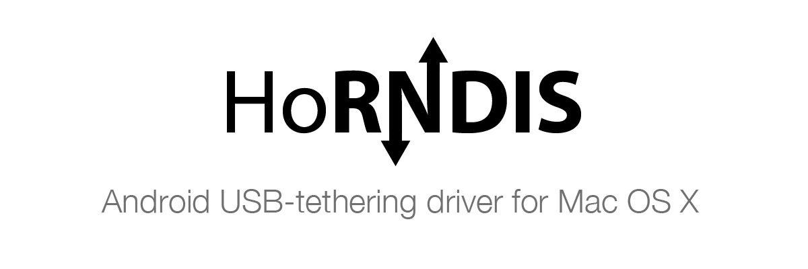

**HoRNDIS** (pronounce: *"horrendous"*) is a driver for Mac OS X that allows you to use your Android phone's native [USB tethering](http://en.wikipedia.org/wiki/Tethering) mode to get Internet access.

For more information, [visit the home page for HoRNDIS](http://www.joshuawise.com/horndis).

## Building the source
* `git clone` the repository
* Simply running xcodebuild in the checkout directory should be sufficient to build the kext. (see below for which project to use).

*Please don't publish versions you built as if they were official!*

**For Mac OS X 10.6 or higher**  
If you wish to package it up, you can run make to assemble the package in the `build/` directory.  
For development use the `HoRNDIS.xcodeproj` on Xcode 4.0 or higher.

**For Mac OS X 10.5 or lower**  
Don't use `make` if you want to build for 10.4 or 10.5.  
Use the `HoRNDIS_PPC.xcodeproj` on Xcode 3.1.4 preferably.  
To package your kext, use the PackageMaker files in the `package/` directory according to what you want to include.

[^download_footer]: To download the installation package, please [visit](http://www.joshuawise.com/horndis).  
For binaries for Leopard and earlier, check the releases of this repo.

## Installation

* Get the installation package (Download[^download_footer] or [Build](#building-the-source) the installation package from source yourself)
* Run the installation package
* Assuming that the installation proceeds without errors, after it completes, connect your phone to your Mac by USB.
* Enter the settings menu on your phone.
* In the connections section, below Wi-Fi and Bluetooth, select “More...”.
Select “Tethering & portable hotspot”.
* Check the “USB tethering” box. It should flash once, and then become solidly checked.

## Uninstallation

* Delete the `HoRNDIS.kext` under `/System/Library/Extensions` and `/Library/Extensions` folder
* Restart your computer
